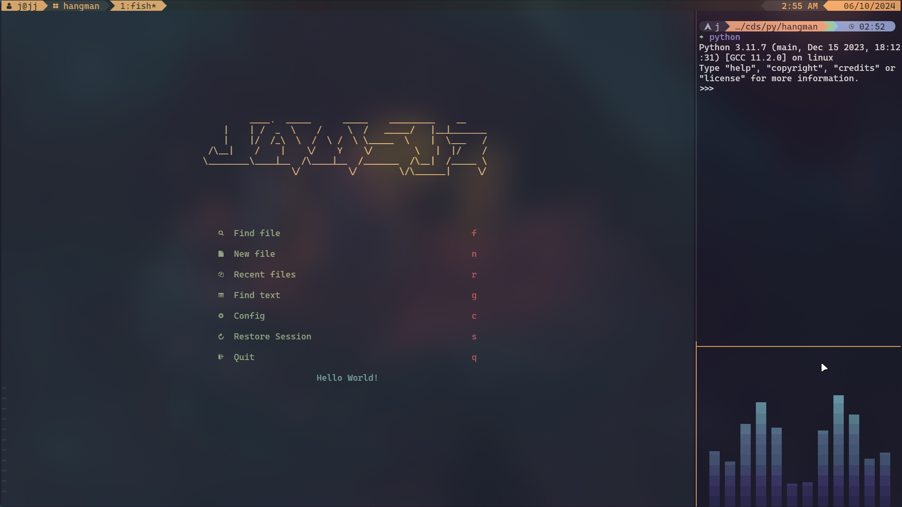

# dotfiles
This is a repo of my dotfiles.
Stow should be installed.

Also note that this is done in arch with hyprland and i3wm.

```bash
pacman -S stow i3-wm hyprland
cd $HOME
git clone https://github.com/jamsjz/dotfiles
cd dotfiles
stow */
```


You are good to go

# Hyprland


# Neovim


